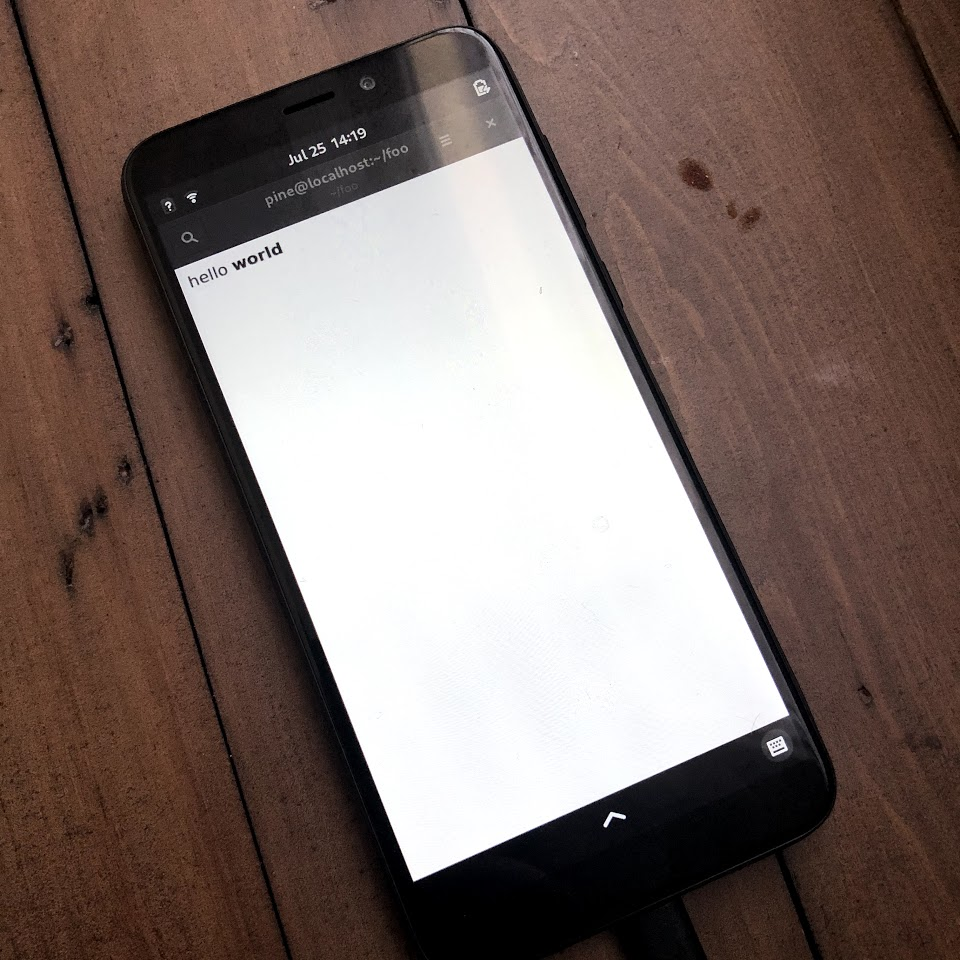

# pinephone-electron-starter

Run electron ( https://www.electronjs.org/ ) app on pinephone, this repo contains a hello world to get started.

```
wget https://nodejs.org/dist/v12.18.3/node-v12.18.3-linux-arm64.tar.xz
tar -xf node-v12.18.3-linux-arm64.tar.xz
mv node-v12.18.3-linux-arm64 ~/.node
export PATH=$PATH:~/.node/bin
npm install -g electron
electron main.js
```

